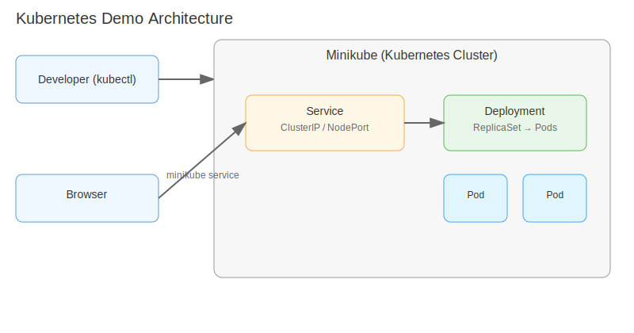

# Kubernetes Demo (Docker + Minikube)

This repository contains a simple Express API containerized with Docker and deployed to a local Kubernetes cluster using Minikube.



---

## Quick Start

### Prerequisites
- Docker
- Minikube
- kubectl

### Build and Push Image
Use the helper script or run commands manually.

```bash
# One command
npm run deploy

# Or manually
docker build -t mohamedaassouu/kubernetes_demo-api:latest .
docker push mohamedaassouu/kubernetes_demo-api:latest
```

### Deploy to Kubernetes (Minikube)
```bash
kubectl apply -f k8s/deployment.yaml
kubectl apply -f k8s/service.yaml
kubectl get pods
kubectl get services
```

### Access the Service
```bash
minikube service kubernetes-demo-api-service
# or get the URL directly
minikube service kubernetes-demo-api-service --url
```

---

## Repo Structure
- Dockerfile — build image for the API
- deploy.sh — build, push, and apply k8s manifests
- k8s/deployment.yaml — Kubernetes Deployment for the API
- k8s/service.yaml — Kubernetes Service for the API
- docker.md — Docker commands cheat-sheet
- kubernetes.md — Minikube + kubectl guide
- assets/architecture.svg — project architecture diagram

---

## Common Commands

### Docker
```bash
docker build -t myapp:latest .
docker run -d --name myapp -p 8080:80 myapp:latest
docker logs -f myapp
docker push mydockerhubuser/myapp:latest
```

### Kubernetes / Minikube
```bash
minikube start
kubectl get nodes
kubectl apply -f k8s/deployment.yaml
kubectl apply -f k8s/service.yaml
kubectl get pods -w
minikube service kubernetes-demo-api-service
```

---

## Troubleshooting
- CrashLoopBackOff: check logs `kubectl logs <pod> -p` and `kubectl describe pod <pod>`.
- Version mismatch warnings: use `minikube kubectl -- …` or install a matching kubectl version.
- Image not found: ensure your pushed tag matches `image:` in `k8s/deployment.yaml`.

---

## References
- Minikube Docs: https://minikube.sigs.k8s.io/docs/start/
- Kubernetes Docs: https://kubernetes.io/docs/home/

